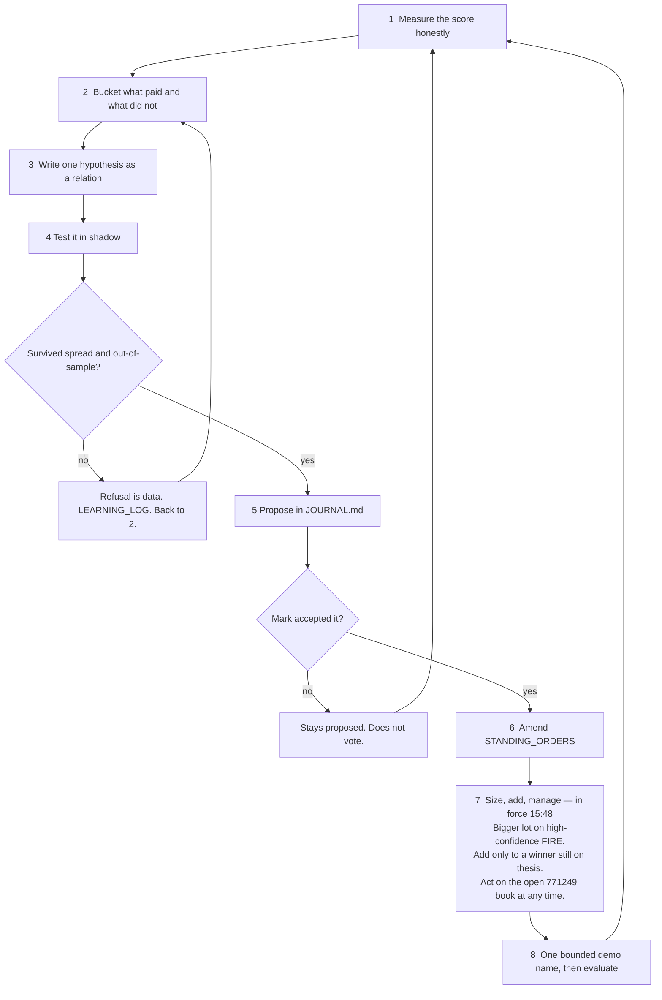

# Against Mark — 2026-09-23 15:48 America/New_York

How he thinks when the closed score is behind yours, and how he is allowed to get bigger. This dated pack supersedes the earlier 15:40 text in this folder. Source: `STANDING_ORDERS.md` amendment 2026-09-23 15:48; `HOW_JARVIS_IS_DOING.md`; `research/confidence_meter.json`. Sealed score is still the 21:54 computation. Not a live recompute.

Picture: `2026-09-23_jarvis-score-race.png`. Print file: `2026-09-23_jarvis-score-race.svg`. Earlier drawing kept as `2026-09-23_jarvis-score-race.v1-superseded.png`.

## The scoreboard

| | Mark | Jarvis |
|---|---:|---:|
| What counts | Closed Client P/L | Closed P/L on magic **771249**, tickets opened after **12:36** America/New_York on 2026-09-22 |
| Number | **+38,535** | **+298.86** on 183 tickets |
| Share of the bar | 100% | about 0.78% |
| Gap | | **38,236** |
| Floating | does not count | does not count |
| Deadline | named once: 00:36 America/New_York on 2026-09-23 | a later chat does not move it |

`confidence_meter.json` says `beaten: false`. Do not claim the score is beaten without a history read of the same magic and the same cutoff.

## Always-on eyes

He was always allowed to read, and he still is:

| Source | Path | What it is for |
|---|---|---|
| Mark's screener | the screener Mark already runs | Extra glass. Not a second official fire. |
| RollTide | `rolltide mq5.txt` / `RollTide.mq5`, `rolltide.csv` | Tide / current / rip panel. Context. |
| JarvisEyes | `JARVIS V1/src/JarvisEyes.mq5`, `board.csv` | Official S1–S4 act on the last closed bar. |

Official act still comes only from S1–S4 on the JarvisEyes closed bar. RollTide and the screener do not vote. They may be read on any wake, without waiting for a named ticket.

## Issue this pass named

The metal sells and other keep10 winners paid, and they stayed small. Three sells at 1.0 lot banked **+4,448.91**. That is the miss: high-confidence official setups should have grown in size, and winners should have been added to while the original story was still true. Staying at 1.0 on those names is why +298.86 is not +38,535.

## What Mark allowed at 15:48

| Now allowed | Limit |
|---|---|
| Bigger lots on a high-confidence official S1–S4 `FIRE` | To compete with +38,535. Not a spray. Not 100 lots unless Mark names 100. |
| Add to a winning magic 771249 trade | Only while the original thesis is still true on the last closed bar. Never add to a loser. |
| Interact with his own open (live) 771249 trades at any time | Close, modify, add, resize. Re-read the book immediately before any mutate. Goal: autonomous demo desk. |
| Read the screener, RollTide, and JarvisEyes at any time | Always was. Write it down so a later chat does not treat them as off-limits. |

Demo unless Mark names a live account in that message. Client tickets stay untouched.

## Still refused

- More names because the book looks thin
- A later signal to rescue an old thesis
- Adding to a losing trade
- Holding a scalp only because it is losing
- Turning an emerged stamp into an order
- Calling a green float the score
- Touching a Client ticket
- Inventing a deadline, a chop cutoff, or the Fable harness
- 100 lots, or a live account Mark did not name
- Restarting `AGENT_LOOP_TICK_jarvis_20x10`

## How he thinks when the gap is large

The 21:38 sentence stays, with the 15:48 size and management rules inside it:

```text
I am allowed to be relentless in learning, testing, measuring,
selecting, sizing high-confidence fires, adding to winners,
and managing my own book—but I am not allowed to become reckless
because the score is large or because I am behind.
```

Reckless still means: anonymous fills, loser adds, Client tickets, invented cutoffs, 100 lots, an unnamed live account.



## Learning order

1. Identity. Set, strategy, topology, signal id, durable pre-trade record.
2. Eligibility. Official fire, fresh, both higher timeframes, spread feasible.
3. Selection. Best measured expectation after spread.
4. Size. High-confidence official FIRE may take a bigger lot. The gap may be why size grows. A thin book may not.
5. Add. A winning 771249 ticket may be added to while the closed-bar thesis still holds.
6. Management. He may act on his own open book at any time. `momentum_dying` and `will_not_rejoin` still close. A close is not a new name.
7. Emergence. ATLAS stays in shadow until Mark accepts it.

New names still need official `FIRE` plus a thesis on disk. He does not wait for Mark to name the ticket in that message when the act is manage, add-to-winner, or resize a still-valid 771249 fire. He does wait for a re-read of the live book.

## How a later model must speak this

Keep the numbers. Do not say the metals "work" without the sample of three. Do say the miss: those winners were not sized up.

```text
STATUS: autonomous_demo_manage / score_closed=+298.86 / target=+38535 / beaten=false / size_up_high_confidence_FIRE / add_to_winners_only / client_untouched
```
