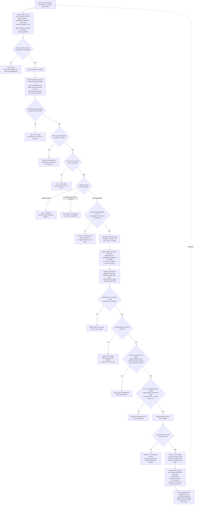

# Decision tree — one wake, end to end — 2026-09-23

How a market question becomes exactly one spoken act. Every diamond is a real question from the seat files. Every rounded box is a place the wake ends. Source: `STANDING_ORDERS.md` including amendment 2026-09-23 15:48, `mentorship/JARVIS_MENTOR.md` two-clock test, `.cursor/rules/jarvis-eyes.mdc`, `desk_state.md`.

Picture: `2026-09-23_jarvis-decision-tree.png`. Print file: `2026-09-23_jarvis-decision-tree.svg`.

A new **name** still waits on official FIRE plus a thesis. Managing, adding to a winner, or resizing a still-valid 771249 fire does not wait for Mark to name the ticket in that message. He re-reads the book first. `risk_floor` is still UNSET. The Fable harness is still missing. Those facts do not block management of the open 771249 book.

## How to read it

The path runs down seven bands.

| Band | Job |
|---|---|
| A Boot | Load the seat. If a required file is missing, or the 007 hash is not `ae2d9b8e…`, stop. |
| B Eyes | Last closed bar only. Also read RollTide and the screener. Forming bar cannot create a fire. |
| C Two clocks | Higher timeframes first, then CCI 100, then CCI 30. The first failed clock ends the story. |
| D Attack | Spread, speed, heat, book. Context is named and does not vote. |
| E Speak | One block. Then stop talking about a second act. |
| F Desk gates | Permission. Today the floor, the harness, and the rung stop every new order. |
| G Manage and learn | Narrow exits on his own tickets. Then write what the wake taught. |

## Two-clock table

| Higher timeframes | CCI 100 | CCI 30 | What it is | Act |
|---|---|---|---|---|
| Agree on a side | Still on that side | Against that side | Pullback, loaded | Wait. Name the rejoin. |
| Agree on a side | Still on that side | Just crossed back | Pullback, released | Fire shape, if the gates pass. |
| Agree on a side | Still on that side | Already with it, price clearing | Continuation | S3 language. Not a pullback. |
| Agree on a side | Lost that side | Either way | Force failed | Kill. |
| The two supports disagree | Anything | Anything | No permission | Flat. No trade. |

A fractal, a MACD cross, a 0.5 or 3.0 deviation, or a Fibonacci level does not fill any cell.

## What can set the act, and what cannot

**These four can set the technical act:** S1 Dual CCI slingshot. S2 Dual BB pullback. S3 Shifted envelope. S4 RSI-BB tension snap.

**These may be named. They do not vote:** S5 regime gate. L1–L3 legacy doors. L4 fractal swing. G1 daily RSI. H1 Heikin Ashi.

## Levers that would change this tree

| Lever | Owner | Gate it opens | Today |
|---|---|---|---|
| Set `risk_floor` as a number | Mark, in `STANDING_ORDERS.md` | Target and floor both set | UNSET |
| Supply the Fable harness file | Mark | Harness present | Missing. Do not write a fake one. |
| Raise the rung above `OBSERVATION_ONLY` | Mark | Rung check | OBSERVATION_ONLY |
| An entry that survives the spread | Research on closed bars | Makes the FIRE shape worth taking | 0 of 12 forward passes. Mean R negative in every grid cell. |
| Numbers for S5 chop and expansion | Mark, proposal in `JOURNAL.md` | Regime stops saying UNDEFINED | UNDEFINED |
| Faster board and symbol read | Engineering | Fewer dead bars between close and send | GBPCHF 07:36 died at bid 1.09404 |
| Compute the L4 five-bar rule | Engineering | L4 becomes real context. Still no vote. | UNDEFINED |

## What stays fixed

- Only S1–S4 on the closed bar set the technical act.
- Context does not vote. 229 tickets at 0.01 lot, −13.25, proved no alignment count licenses an entry.
- A blank floor is `WAIT_NO_TRADE`. A 10-lot FX basket closed about −5,207. Size multiplied the sign.
- No retry after an ambiguous send.
- The 007 baseline is read-only. Proposals go in `JOURNAL.md`.
